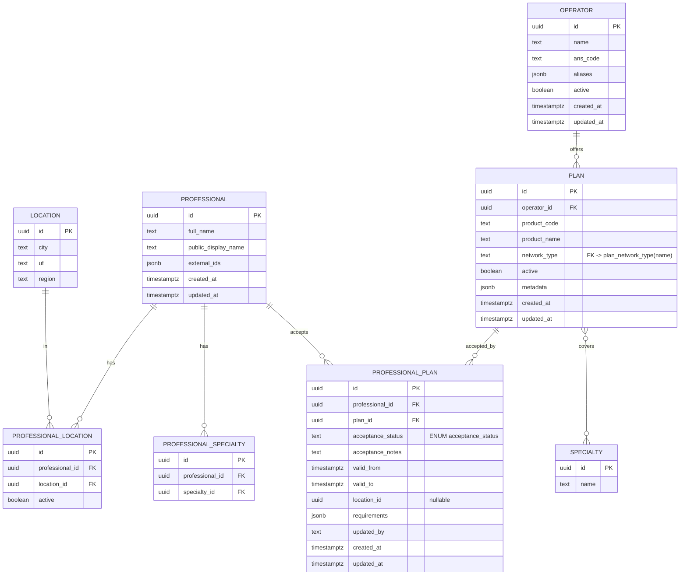

```mermaid
erDiagram
    PROFESSIONAL ||--o{ PROFESSIONAL_LOCATION : has
    LOCATION ||--o{ PROFESSIONAL_LOCATION : in
    OPERATOR ||--o{ PLAN : offers
    PLAN ||--o{ PROFESSIONAL_PLAN : accepted_by
    PROFESSIONAL ||--o{ PROFESSIONAL_PLAN : accepts
    PLAN }o--o{ SPECIALTY : covers
    PROFESSIONAL ||--o{ PROFESSIONAL_SPECIALTY : has

    PROFESSIONAL {
      uuid id PK
      text full_name
      text public_display_name
      jsonb external_ids
      timestamptz created_at
      timestamptz updated_at
    }

    LOCATION {
      uuid id PK
      text city
      text uf
      text region
    }

    PROFESSIONAL_LOCATION {
      uuid id PK
      uuid professional_id FK
      uuid location_id FK
      boolean active
    }

    OPERATOR {
      uuid id PK
      text name
      text ans_code
      jsonb aliases
      boolean active
      timestamptz created_at
      timestamptz updated_at
    }

    PLAN {
      uuid id PK
      uuid operator_id FK
      text product_code
      text product_name
      text network_type   "FK -> plan_network_type(name)"
      boolean active
      jsonb metadata
      timestamptz created_at
      timestamptz updated_at
    }

    SPECIALTY {
      uuid id PK
      text name
    }

    PROFESSIONAL_SPECIALTY {
      uuid id PK
      uuid professional_id FK
      uuid specialty_id FK
    }

    PROFESSIONAL_PLAN {
      uuid id PK
      uuid professional_id FK
      uuid plan_id FK
      text acceptance_status  "ENUM acceptance_status"
      text acceptance_notes
      timestamptz valid_from
      timestamptz valid_to
      uuid location_id "nullable"
      jsonb requirements
      text updated_by
      timestamptz created_at
      timestamptz updated_at
    }
```