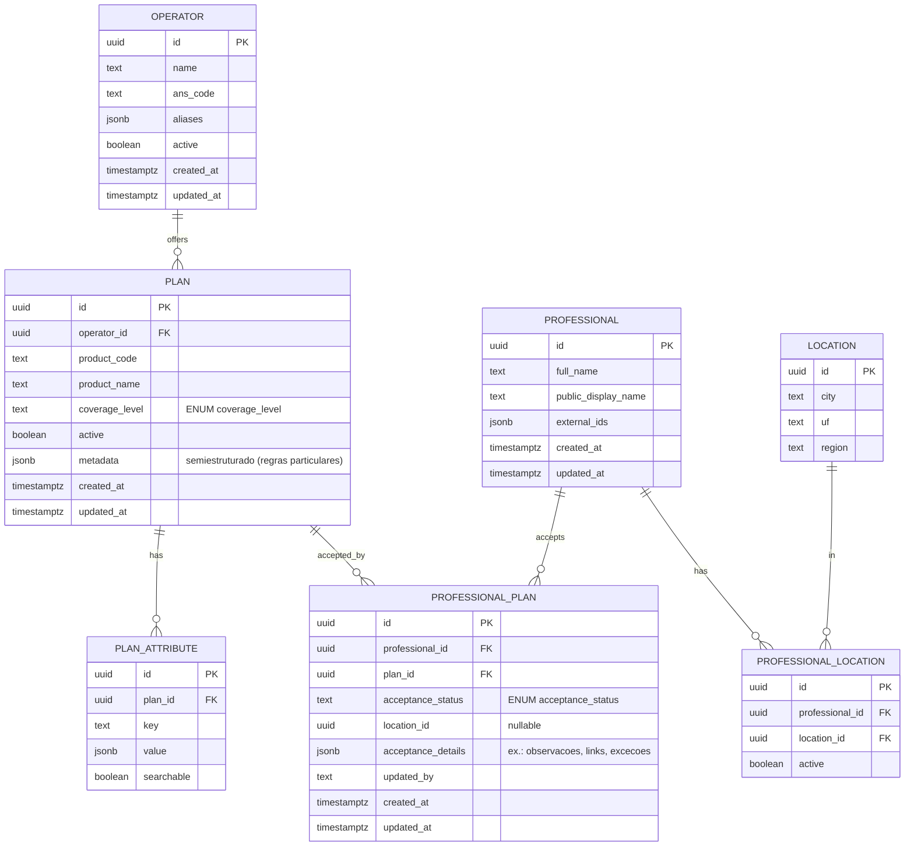

```mermaid
erDiagram
    PROFESSIONAL ||--o{ PROFESSIONAL_LOCATION : has
    LOCATION ||--o{ PROFESSIONAL_LOCATION : in
    OPERATOR ||--o{ PLAN : offers
    PLAN ||--o{ PLAN_ATTRIBUTE : has
    PLAN ||--o{ PROFESSIONAL_PLAN : accepted_by
    PROFESSIONAL ||--o{ PROFESSIONAL_PLAN : accepts

    PROFESSIONAL {
      uuid id PK
      text full_name
      text public_display_name
      jsonb external_ids
      timestamptz created_at
      timestamptz updated_at
    }

    LOCATION {
      uuid id PK
      text city
      text uf
      text region
    }

    PROFESSIONAL_LOCATION {
      uuid id PK
      uuid professional_id FK
      uuid location_id FK
      boolean active
    }

    OPERATOR {
      uuid id PK
      text name
      text ans_code
      jsonb aliases
      boolean active
      timestamptz created_at
      timestamptz updated_at
    }

    PLAN {
      uuid id PK
      uuid operator_id FK
      text product_code
      text product_name
      text coverage_level "ENUM coverage_level"
      boolean active
      jsonb metadata  "semiestruturado (regras particulares)"
      timestamptz created_at
      timestamptz updated_at
    }

    PLAN_ATTRIBUTE {
      uuid id PK
      uuid plan_id FK
      text key
      jsonb value
      boolean searchable
    }

    PROFESSIONAL_PLAN {
      uuid id PK
      uuid professional_id FK
      uuid plan_id FK
      text acceptance_status "ENUM acceptance_status"
      uuid location_id "nullable"
      jsonb acceptance_details "ex.: observacoes, links, excecoes"
      text updated_by
      timestamptz created_at
      timestamptz updated_at
    }
```